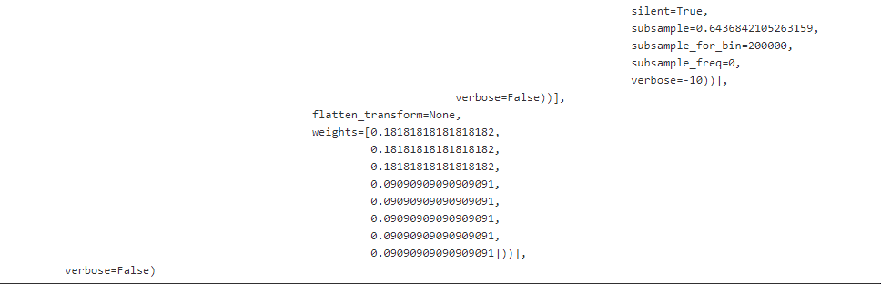
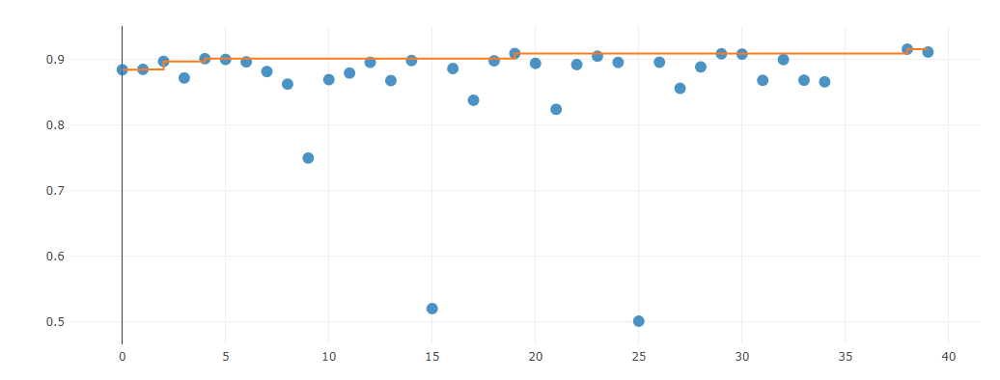
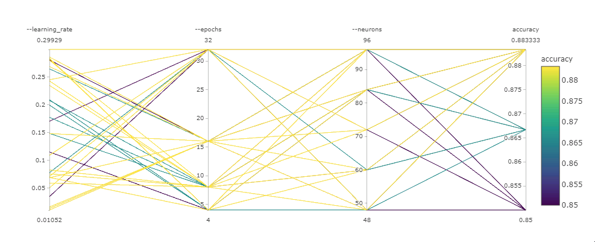

# Heart failure prediction using auto ML and hyper-drive

Two powerful features of Azure ML are used to get the best classification model, auto ML and hyperdrive. Auto ML trains different kinds of models while the hyper drive trains a custom model (neural network was chosen) with different kind of hyper parameters. The best model out of both will be deployed and tested by sending requests and receiving the model prediction.  
The used dataset is the heart failure prediction dataset provided by Kaggle.

## Project Set Up and Installation
The project uses an external dataset from Kaggle. This dataset has to be registered in Azure Studio under the name "Heart-failure-prediction" so it can be used in jupyter notebook. A copy of the dataset (as csv) is provided in the repo under data folder.

## Dataset

### Overview
The dataset that was used in the project is the heart failure prediction dataset provided from Kaggle. A description of the dataset can be found under the link 
https://www.kaggle.com/andrewmvd/heart-failure-clinical-data

### Task
*TODO*: Explain the task you are going to be solving with this dataset and the features you will be using for it.
We are going to use the heart failure prediction dataset to train a classification model which predicts if an individual is going to die or not. The dataset, in each entry, provides several properties(features) about individual and a binary label which tells if that individual died or not due to heart failure. The features are (as Kaggle describes them):  
**Age**  
**Anaemia**: Decrease of red blood cells or hemoglobin(boolean)  
**creatinine_phosphokinase**: Level of the CPK enzyme in the blood (mcg/L)  
**diabetes**: If the patient has diabetes (boolean)  
**ejection_fraction**: Percentage of blood leaving the heart at each contraction (percentage)  
**high_blood_pressure**: If the patient has hypertension (boolean)  
**platelets**: Platelets in the blood (kiloplatelets/mL)  
**serum_creatinine**: Level of serum creatinine in the blood (mg/dL)  
**serum_sodium**: Level of serum sodium in the blood (mEq/L)  
**sex**: Woman or man (binary)  
**smoking**: If the patient smokes or not (boolean)  
**time**: Follow-up period (days)  
**DEATH_EVENT**: If the patient deceased during the follow-up period (boolean)  

### Access
*TODO*: Explain how you are accessing the data in your workspace.
I uploaded the dataset by uploading the dataset csv file. For convenience I provided the csv fle in github repo. The name of the registered dataset shall be "Heart-failure-prediction" since I use this name when accessing the dataset from my jupyter notebook. To access the dataset from the notebook, I used the Dataset module from azure.core package to read the dataset and afterwards converted it to pandas datafram. The dataset is now ready to be used when creating the two experiments, auto ML and Hyperdrive.

## Automated ML
*TODO*: Give an overview of the `automl` settings and configuration you used for this experiment
**Auto ML settings**: Settings which controls the operation of the auto ml experiment  
1. experiment_timeout_minutes: 20, The experiments shall not run longer than 20 minutes, meaning no new models are tested after 20 minutes
2. max_concurrent_iterations": 5, The maximum number of parallel runs (models under test)
3. primary_metric" : 'AUC_weighted', The metric used to evaluate the models and choose the best one
**Auto ML configuration**: Configuration of the task that will run in the auto ML experiment
1. task: classification, the task is binary classification
2. training_data=dataset, the dataset used for training
3. compute_target=cpu_cluster, the compute target to be used
4. label_column_name="DEATH_EVENT", The label of dataset entries
5. path=".", Path where to save the auto ML output data
6. enable_early_stopping=True, Stop training once the metric does not get improved any further
7. featurization='auto', 

### Results
*TODO*: What are the results you got with your automated ML model? What were the parameters of the model? How could you have improved it?
The best model was a Voting Ensemble (as we learned in the phase 1) with accuracy about 0.92.  

What were the parameters of the model?  
The parameters of the best model can be seen in the image  

How could you have improved it?  
Incearsing the number of estimators could improve the model accuracy, other aspects might be feature engineering; creating new features or dropping some.  

*TODO* Remeber to provide screenshots of the `RunDetails` widget as well as a screenshot of the best model trained with it's parameters.  
screenshots of the `RunDetails`

## Hyperparameter Tuning
*TODO*: What kind of model did you choose for this experiment and why? Give an overview of the types of parameters and their ranges used for the hyperparameter search  
I used a deep learning model, since this was not tested in the auto ML experiment, with one hidden layer. The hyper parameters I used to tune using hyperdrive are:  
learning rate, number of epochs, and the number of neurons in the hidden layer. The range of each parameter was as follows:  
1. learning_rate: uniform(0.01, 0.3) (continuous)
2. epochs: choice(4, 8, 16, 32) (discrete)
3. neurons: choice(48, 60, 72, 84, 96) (discrete)  

### Results
*TODO*: What are the results you got with your model? What were the parameters of the model? How could you have improved it?
The best model I got with the hyperdrive is  

*TODO* Remeber to provide screenshots of the `RunDetails` widget as well as a screenshot of the best model trained with it's parameters.

## Model Deployment
*TODO*: Give an overview of the deployed model and instructions on how to query the endpoint with a sample input.
By comparing the results of the auto ML and the hyperdrive, the best model is the one achieved by the auto ML. The best model is then deployed using Azure python SDK. The following image shows the deployed model in the healthy state along with the scoring uri API that can be used to interact with the deployed model  

To query the endpoint one needs to provide json datatype with the required input features as the following example:  
"age": 17,  
"anaemia": 1,  
"creatinine_phosphokinase": 600,  
"diabetes": 1,  
"ejection_fraction": 30,  
"high_blood_pressure": 0,  
"platelets": 263000,  
"serum_creatinine": 1.2,  
"serum_sodium": 130,  
"sex": 1,  
"smoking": 0,  
"time": 15,  

## Screen Recording
Here is a link to the screencasting in which I describe the following aspects:
- A working model
- Demo of the deployed  model
- Demo of a sample request sent to the endpoint and its response

https://youtu.be/BIaTe5ZHJTg

